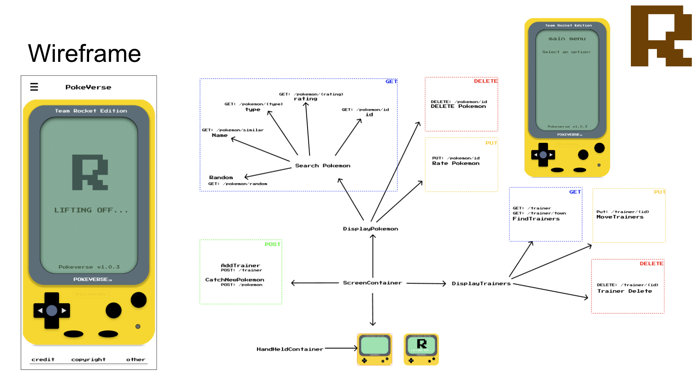

# Read Me
## Background
We were given the backend bit by Team Staryu. 

> Team All Staryu - “A virtual space for Pokemon trainers and their Pokemon, with the ability to edit data and encourage social interactions.”

After examining the backend functionalities, taking into account team All Staryu’s vision and Team Rocket’s need for total world domination, we decided to design a Pokedex for all Team Rocket personnel.

## What we need to achieve
**Pokemon**
- See information of all Pokemon
- Capture any and all Pokemon
- Rate all captured Pokemons as we only want the best
**Team Rocket**
- Be able to find and relocate all personnel
- Recruit new trainers
- Fire any personnel
- Allow all members to practise Pokemon battles
**Design**
We are inspired by the _Pokemon Pikachu Handheld_ device and decide to make a replica. Wireframe is down below.

## Functionality
You will be able to view pokemons, get a similar pokemon by name and get a random pokemon. You can also delete a pokemon or update pokemon. 

As a trainer you can also see all trainers, edit your location, or delete a trainer. 